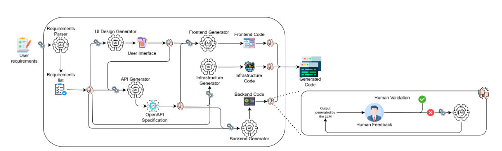

# AI-based Pipeline for Automated Software Development

This repository contains all artefacts related to the development of a Master’s Oriented Study thesis in Computer Engineering, focused on the design and implementation of an AI-based pipeline for automated software development.

The project is developed within the MSc in Computer Engineering at the Faculty of Sciences of the University of Lisbon, in collaboration with Trust Systems.

The core objective is to design, implement, and evaluate a modular pipeline based on Large Language Models (LLMs) capable of transforming user's descriptions into software artefacts.

---

## 🎯 Objectives

The main objectives of this thesis are:

- Design a modular and incremental pipeline for automating software development stages
- Apply prompt engineering techniques to guide and control model behaviour
- Evaluate the quality and consistency of generated artefacts
- Integrate human-in-the-loop validation throughout the pipeline

---

## 🧠 Proposed Pipeline

The proposed solution is organised as an incremental pipeline composed of the following modules:

1. Requirements Structuring  
2. Interface Generation  
3. API Specification Generation  
4. Backend Code Generation  
5. Frontend Code Generation  
6. Infrastructure Generation  

Each module:
- consumes artefacts produced by the previous module,
- produces structured and reusable outputs,
- includes human validation before proceeding to the next stage.

### Pipeline Overview

---

## 🛠️ Orchestration Tool

The pipeline is orchestrated using **Flowise**.

A detailed justification of this choice is available in  
[`docs/technical_decisions/orchestration_tool.md`](docs/technical_decisions/orchestration_tool.md)

---

## 📁 Repository Structure

- `assets/` — shared visual resources (logos, diagrams, and images) used across documentation and module pages  
- `docs/` — academic documents, presentations, and technical decisions  
- `modules/` — all the information relating to each of the modules

---

## 🚧 Implementation Status

The implementation of the pipeline is being carried out incrementally.  
Each module will be developed, validated, and refined individually before full integration.

- [🚧] Requirements Structuring Module  
- [ ] Interface Generation Module  
- [ ] API Specification Generation Module  
- [ ] Backend Code Generation  
- [ ] Frontend Code Generation  
- [ ] Infrastructure Generation  

---

## 📅 Planning

The project objectives are documented in  
[`docs/planning/objectives_and_timeline.pdf`](docs/planning/schedule_objective.pdf)

### Timeline Overview

---

## 👤 Author

**Gustavo Henriques**  
MSc in Computer Engineering  
Faculty of Sciences, University of Lisbon

