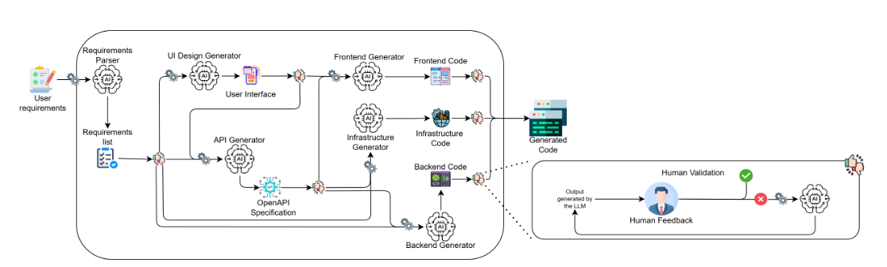
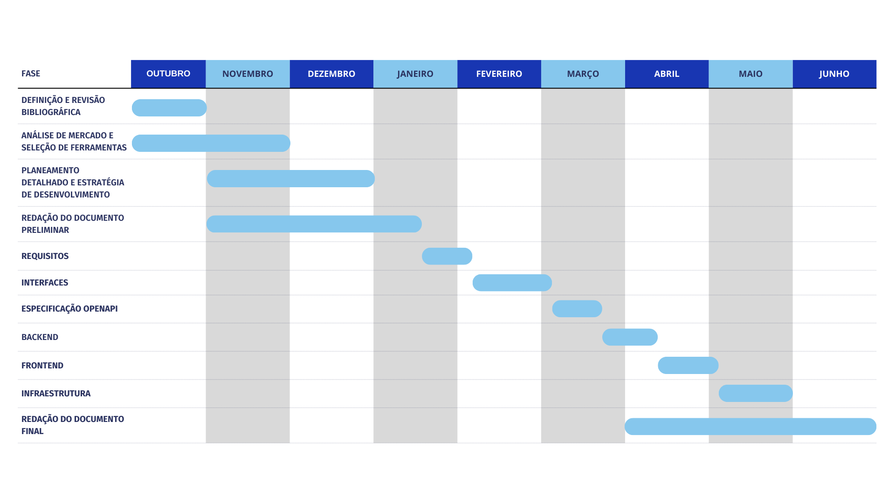

# AI Codegen Thesis

Modular AI-assisted software generation research workspace, grounded in the Trust Systems development process.

## Overview

This repository supports the thesis work documented in:

- `docs/oriented_study/oriented_study.pdf`

Primary objective:

- Design and evaluate a pipeline that uses LLMs plus prompt engineering to automate selected software development phases, with human validation between phases.

## Automation Scope

| In Scope | Description |
| --- | --- |
| Requirements interpretation | Transform initial client input into structured requirements |
| UI generation | Produce interface artifacts and interaction flows |
| API generation | Build OpenAPI contracts aligned with validated requirements/UI |
| Backend generation | Generate service logic and API implementation artifacts |
| Frontend generation | Generate UI implementation aligned with API contracts |
| Infrastructure generation | Generate runtime/deployment support artifacts |
| Test support | Generate baseline tests integrated into generated modules |

Out of scope:

- Business strategy and market viability analysis remain human-led.

## Pipeline View

The process is sequential, artifact-driven, and validated incrementally.



Control principles used across this project:

- Human-in-the-loop validation
- Prompt-driven iterative refinement
- Incremental module progression
- Mixed evaluation (automatic metrics + expert review)

## Repository Structure

```text
ai-codegen-thesis/
|- applications/                 # Generated software versions (v1..v6)
|- assets/                       # Visual assets used by docs and reports
|- docs/                         # Oriented study, dissertation, analyses
|- prompts/                      # Prompt history (initial + refinements)
|- workflows/n8n-progress/daily/ # Daily n8n workflow JSON snapshots
```

Quick references:

- Applications details: `applications/README.md`
- Prompt usage guide: `prompts/README.md`
- n8n progress guide: `workflows/n8n-progress/README.md`

## Generated Application Versions

The versions in `applications/` (`v1` to `v6`) were produced with Codex in VS Code via prompt engineering, where each phase was generated from a single prompt.

## Working Method

1. Define a prompt for one module.
2. Generate the artifact.
3. Validate output quality.
4. Refine prompt and regenerate when needed.
5. Store artifacts, prompts, and workflow snapshots.

## Supporting Timeline


